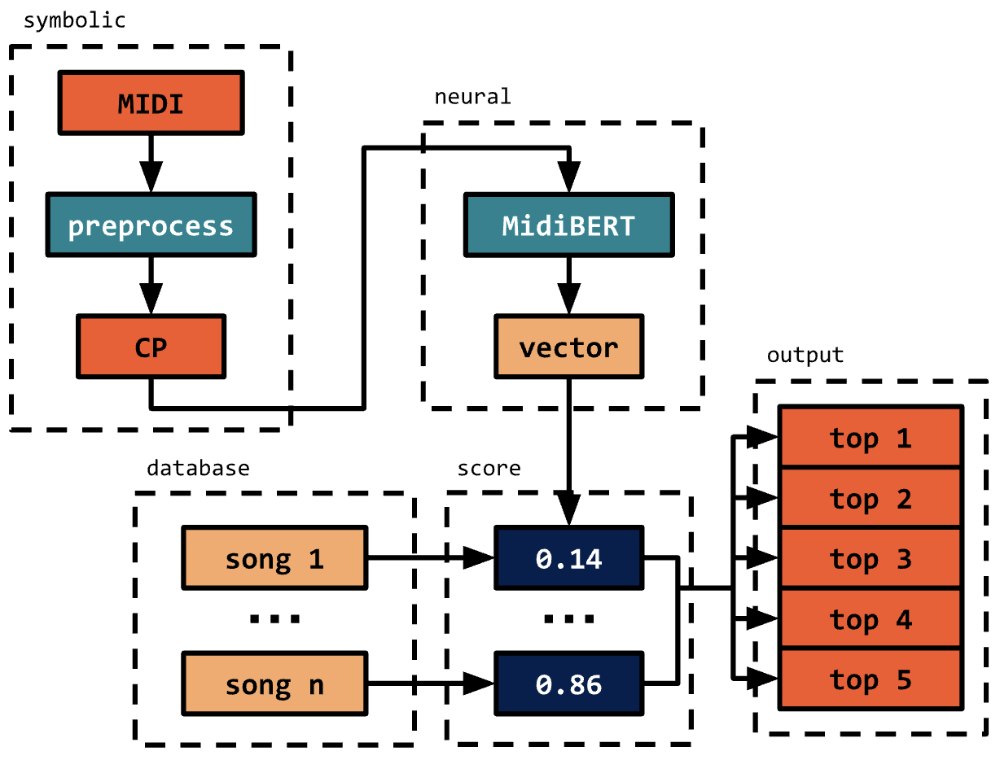

# BeMuse
A tool that is able to match a given MusicXML query to the most similar piece in a database of classical music.

## Setup

### Melody checkpoint

Follow the instructions on the [MidiBERT](https://github.com/wazenmai/MIDI-BERT/tree/CP) GitHub page to download the MidiBERT model checkpoints. Save the `pretrain_model.ckpt` file in the `BeMuse/artifact/midibert` directory.

## Overview

We provide a brief overview of the project setup and the steps used to analyze a MIDI input query. For clarity, a diagram of the model architecture is provided below:

